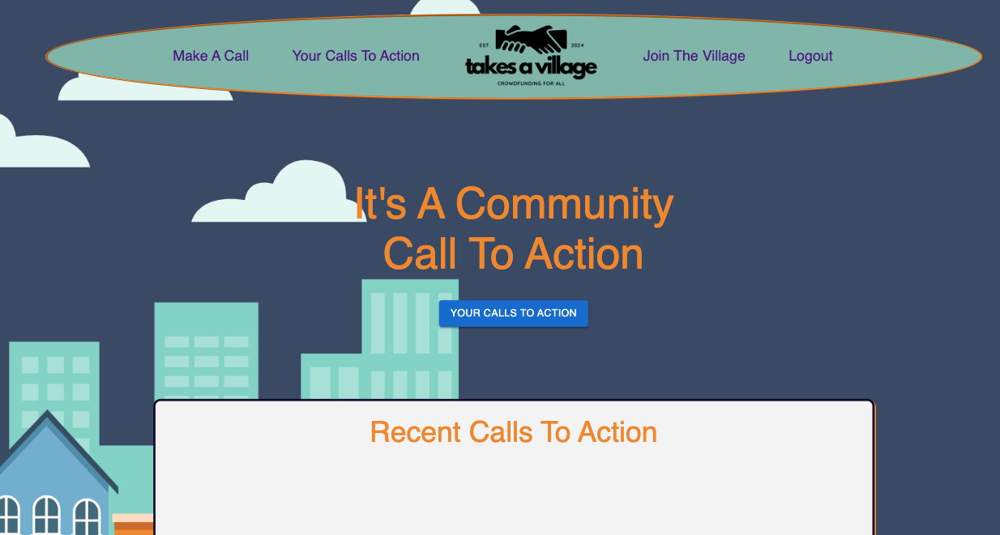
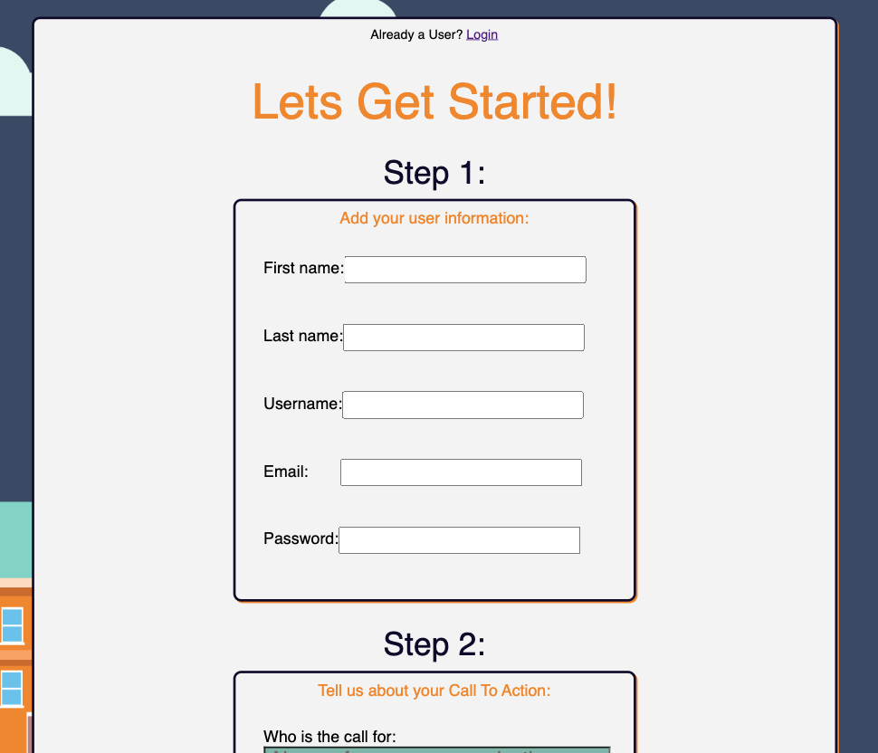

# Takes A Village [](https://opensource.org/licenses/MIT)


## Description:
Takes A Village is a website that allows users to call their community to action for funding for specific needs within their very own social circles and beyond.


## Table of Contents:
- [The Challenge](#The-Challenge)
- [Usage Information](#Usage-Information)
- [Repository URL](#Repository-URL)
- [Netlify Deployment URL](#Netlify-Deployment-URL)
- [Screenshots](#Screenshots)
- [Built With](#Built-With)
- [License](#License)
- [Authors](#Authors)


## The Challenge:
Working with your team, you’ll conceive and execute a design that solves a real-world problem. In creating a collaborative full-stack application, combine a robust back end—with servers, databases, and user authentication—to an intuitive front end.


## Usage Instructions
1. Visit the URL below and follow the instructions to "login" or "Join The Village.
2. Follow the onscreen instuctions to create your first "Call To Action"


## Repository URL:
[Click Here For Repository Link.](https://github.com/aarosan/crowdfund)

## Render Deployment URL:
[Click Here For Netlify Link.](https://takes-a-village.onrender.com/)

## Screenshots:
### Figure 1. Home Page
 
### Figure 2.  Join The Village Page



## Built With
### Dependencies:
1. Nodemon: [2.0.6](https://www.npmjs.com/package/nodemon/v/2.0.6)
2. Dotenv: [16.4.5](https://www.npmjs.com/package/dotenv)
3. Stripe: [14.25.0] (https://www.npmjs.com/package/stripe/v/14.25.0-beta.1)
4. React-Bootstrap [2.10.2] (https://react-bootstrap.netlify.app/)
5. MongoDB [6.5.0] (https://www.npmjs.com/package/mongodb?activeTab=versions)
6. Jwt-decode [4.0.0] (https://www.npmjs.com/package/jwt-decode)
7. Jsonwebtoken [9.0.2] (https://www.npmjs.com/package/jsonwebtoken)
8. Apollo-server-express [3.13.0] (https://www.npmjs.com/package/apollo-server)
9. Material UI [5.15.15] (https://mui.com/material-ui/)
10. Apollo/client [3.9.11] (https://www.npmjs.com/package/@apollo/client)
11. Vite [5.2.0] (https://vitejs.dev/)
12. Node [21.6.2] (https://nodejs.org/en/blog/release/v21.6.2)
13. Eslint [8.57.0] (https://eslint.org/blog/2024/02/eslint-v8.57.0-released/)
14. React-router-dom [6.22.3] (https://www.npmjs.com/package/react-router-dom)


## License & Copyright ©
[](https://opensource.org/licenses/MIT) [Open Source Initiative Link](https://opensource.org/licenses/MIT)


### Copyright © 2024
```md
Permission is hereby granted, free of charge, to any person obtaining a copy
of this software and associated documentation files (the "Software"), to deal
in the Software without restriction, including without limitation the rights
to use, copy, modify, merge, publish, distribute, sublicense, and/or sell
copies of the Software, and to permit persons to whom the Software is
furnished to do so, subject to the following conditions:

The above copyright notice and this permission notice shall be included in all
copies or substantial portions of the Software.

THE SOFTWARE IS PROVIDED "AS IS", WITHOUT WARRANTY OF ANY KIND, EXPRESS OR
IMPLIED, INCLUDING BUT NOT LIMITED TO THE WARRANTIES OF MERCHANTABILITY,
FITNESS FOR A PARTICULAR PURPOSE AND NONINFRINGEMENT. IN NO EVENT SHALL THE
AUTHORS OR COPYRIGHT HOLDERS BE LIABLE FOR ANY CLAIM, DAMAGES OR OTHER
LIABILITY, WHETHER IN AN ACTION OF CONTRACT, TORT OR OTHERWISE, ARISING FROM,
OUT OF OR IN CONNECTION WITH THE SOFTWARE OR THE USE OR OTHER DEALINGS IN THE
SOFTWARE.
```

  
## Authors
Follow our team on Github!
- [joey2522](https://github.com/Joey2522)
- [RLCastaldy](https://github.com/RLCastaldy)
- [aarosan](https://github.com/aarosan)
- [ecbrudner](https://github.com/ecbrudner)


© 2024 [joey2522](https://github.com/Joey2522), [RLCastaldy](https://github.com/RLCastaldy), [aarosan](https://github.com/aarosan), [ecbrudner](https://github.com/ecbrudner), Confidential and Proprietary. All Rights Reserved.
